# Hi, I'm Mateo Herrera 👋

I build solutions at the intersection of artificial intelligence, software
engineering, data science and biotechnology.

## About me

- 🤖 Focused on AI, machine learning and data-driven software
- 🧬 Background in biotechnology and life sciences
- 🧪 Interested in bioinformatics, computer vision and public-health data
- 🛠️ Building applications with Python, TypeScript, React, NestJS and PostgreSQL
- 📚 Currently strengthening my skills in AI agents, RAG and machine learning
- 💼 Open to opportunities in AI/ML, data science and scientific software

## Main technologies

**Artificial intelligence and data**

`Python` · `PyTorch` · `TensorFlow` · `scikit-learn` · `pandas` · `NumPy`

**Software development**

`TypeScript` · `JavaScript` · `React` · `NestJS` · `Node.js` · `PostgreSQL`

**Life sciences**

`Bioinformatics` · `Biopython` · `Bioconductor` · `RNA-Seq` · `qPCR`

## Live GitHub information

<!-- AUTO-GENERATED:START -->
### GitHub snapshot

- **Active public repositories:** 1
- **Stars across active repositories:** 0
- **Most-used repository languages:** No language information available.

### Recently updated projects

- **[Mosquito-Data-Management-System](https://github.com/mateobha/Mosquito-Data-Management-System)** — Sitio oficial de descarga y soporte de Mosquito Data Management System (monitoreo de ovitrampas).
  - `Mixed` · ⭐ 0 · Updated `2026-07-24`

_Automatically updated on 2026-08-07 01:58 — Ecuador time._
<!-- AUTO-GENERATED:END -->

### Contribution activity

## Contact

- LinkedIn: [mateo-herrera-machlearn](https://www.linkedin.com/in/mateo-herrera-machlearn)
- Email: [mateo.bha@outlook.com](mailto:mateo.bha@outlook.com)